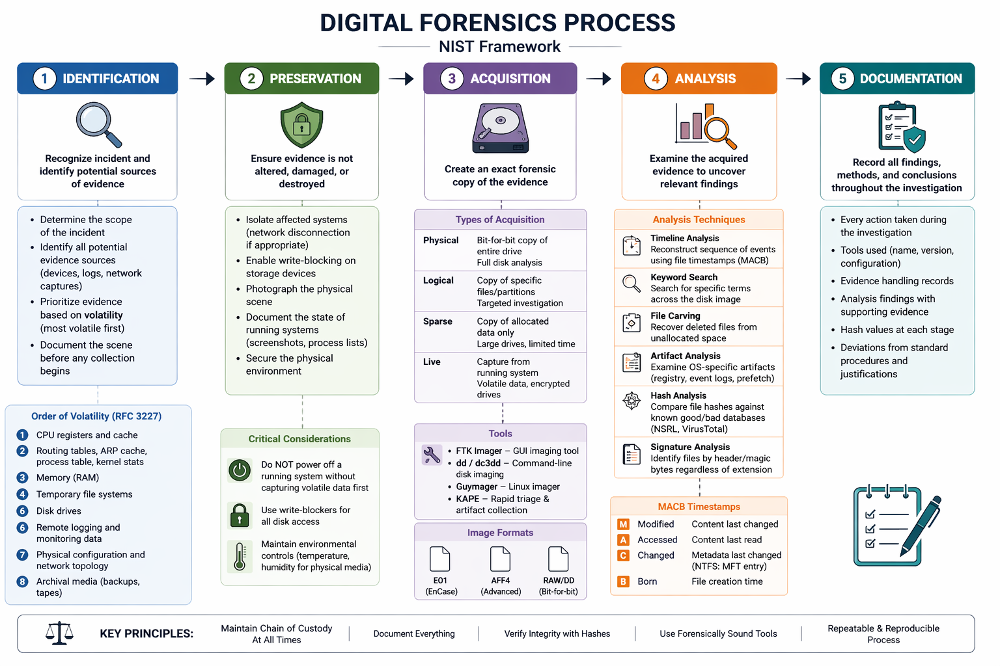

1. Identification

The first step is recognizing that an incident has occurred and identifying potential sources of evidence.
- Determine the scope of the incident
- Identify all potential evidence sources (devices, logs, network captures)
- Prioritize evidence based on volatility (most volatile first)
- Document the scene before any collection begins

**Order of Volatility (RFC 3227):**

1. CPU registers and cache
2. Routing tables, ARP cache, process table, kernel stats
3. Memory (RAM)
4. Temporary file systems
5. Disk drives
6. Remote logging and monitoring data
7. Physical configuration and network topology
8. Archival media (backups, tapes)

### 2. Preservation

Ensuring that evidence is not altered, damaged, or destroyed.

**Activities:**

- Isolate affected systems (network disconnection if appropriate)
- Enable write-blocking on storage devices
- Photograph the physical scene
- Document the state of running systems (screenshots, process lists)
- Secure the physical environment

**Critical Considerations:**

- Do NOT power off a running system without capturing volatile data first
- Use write-blockers for all disk access
- Maintain environmental controls (temperature, humidity for physical media)

### 3. Acquisition

Creating an exact forensic copy of the evidence.

**Types of Acquisition:**

| Type         | Description                       | Use Case                        |
| ------------ | --------------------------------- | ------------------------------- |
| **Physical** | Bit-for-bit copy of entire drive  | Full disk analysis              |
| **Logical**  | Copy of specific files/partitions | Targeted investigation          |
| **Sparse**   | Copy of allocated data only       | Large drives, limited time      |
| **Live**     | Capture from running system       | Volatile data, encrypted drives |

**Tools:**

- **FTK Imager** – GUI-based imaging tool
- **dd** / **dc3dd** – Command-line disk imaging
- **Guymager** – Linux-based forensic imager
- **KAPE** – Rapid triage and artifact collection

**Image Formats:**

- **E01** (EnCase format) – Supports compression and metadata
- **AFF4** – Advanced Forensic Format
- **Raw/dd** – Bit-for-bit, no compression

### 4. Analysis

Examining the acquired evidence to uncover relevant findings.

**Analysis Techniques:**

- **Timeline Analysis**: Reconstruct sequence of events using file timestamps (MACB)
- **Keyword Search**: Search for specific terms across the disk image
- **File Carving**: Recover deleted files from unallocated space
- **Artifact Analysis**: Examine OS-specific artifacts (registry, event logs, prefetch)
- **Hash Analysis**: Compare file hashes against known good/bad databases (NSRL, VirusTotal)
- **Signature Analysis**: Identify files by header/magic bytes regardless of extension

**MACB Timestamps:**

| Letter | Meaning  | Description                             |
| ------ | -------- | --------------------------------------- |
| M      | Modified | Content last changed                    |
| A      | Accessed | Content last read                       |
| C      | Changed  | Metadata last changed (NTFS: MFT entry) |
| B      | Born     | File creation time                      |
|        |          |                                         |

### 5. Documentation

Recording all findings, methods, and conclusions throughout the investigation.

### Course Practical Exercise 1.3

Using the forensic process framework, plan an investigation for the following scenario:

> A company suspects that an employee has been exfiltrating sensitive financial data to a competitor. The employee uses a company-issued Windows laptop and has access to a shared network drive.

1. What evidence sources would you identify?
2. How would you preserve the evidence?
3. What acquisition method would you use?
4. What analysis techniques would you apply?
5. How would you document your findings?

| Step                         | Method                                                                                                                                                                                                                                                                                                                                                             |
| ---------------------------- | ------------------------------------------------------------------------------------------------------------------------------------------------------------------------------------------------------------------------------------------------------------------------------------------------------------------------------------------------------------------ |
| **1. Evidence Sources**      | For this , we must identify all potential sources                                Windows  company laptop (local files, history, USB activity), the shared network drive is critical evidence too since it contains all infos about  file access and transfer logs), we should also consider system/network logs (authentication, access, firewall, and proxy logs) |
| **2. Evidence Preservation** | I would isolating the laptop first from the network to prevent remote access or changes from that employee and also restrict the shared drive to read-only access you do not know who have access to that yet                                                                                                                                                      |
| **3. Acquisition Method**    | for the laptob , we use forensic bit-by-bit imaging to capture all data **FTK Imager**, including deleted files. we can have previous snapshot of the shared network drive                                                                                                                                                                                         |
| **4. Analysis Techniques**   | Artifact and log analysis including file system artifacts, event logs, USB history, and browser activity. Build a timeline of user actions and look for abnormal file transfers, compression tools, or external connections. tools are many : Autopsy , volatility , Event Viewer (Windows)...                                                                     |
| **5. Documentation**         | I would produce a formal forensic report including procedures, tools used, hash values (MD5/SHA256), evidence logs, screenshots, and chain of custody records to ensure integrity and reproducibility.                                                                                                                                                             |

