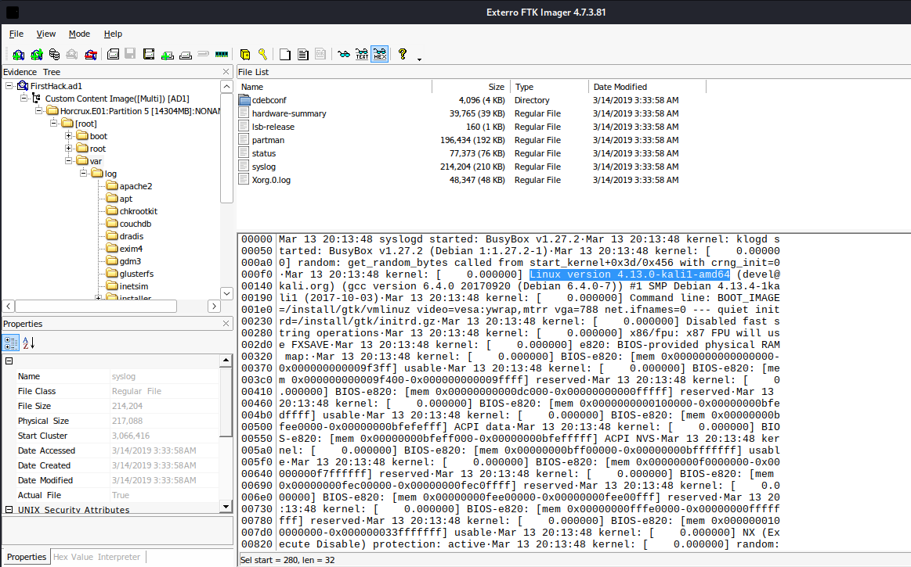

| Tool       | Purpose              | Input                   | Output               | Complexity | Capabilities                                                                   |
| ---------- | -------------------- | ----------------------- | -------------------- | ---------- | ------------------------------------------------------------------------------ |
| Autopsy    | Disk analysis        | Disk images             | Reports, artifacts   | Low        | File recovery, keyword search, timeline analysis, metadata extraction          |
| FTK Imager | Imaging              | Physical/logical drives | E01, dd images       | Low        | Forensic disk imaging, preview evidence, hash verification                     |
| Volatility | Memory analysis      | Memory dumps            | Process/network data | Medium     | Process inspection, hidden malware detection, network connections analysis     |
| Sleuth Kit | File system analysis | Disk images             | Files, timelines     | Medium     | Low-level file system parsing, deleted file recovery, inode analysis           |
| Wireshark  | Network analysis     | PCAP files              | Protocol data        | Medium     | Packet capture, protocol decoding, traffic filtering, session reconstruction   |
| KAPE       | Artifact collection  | Live/mounted systems    | Parsed artifacts     | Low        | Fast forensic triage, registry/log extraction, targeted artifact collection    |
| Plaso      | Timeline generation  | Multiple sources        | Unified timeline     | Medium     | Event correlation, timeline reconstruction, log parsing, multi-source analysis |


### Practical Exercise 1.5 

1. Install each of the listed tools in your forensic workstation
2. Verify tool versions and document in your lab notebook
3. Create a forensic image of a USB drive using FTK Imager
4. Open the image in Autopsy and perform basic analysis
5. Capture network traffic with Wireshark for 5 minutes and identify protocols

1/ for my forensic workstation i use NAME="Kali GNU/Linux"
VERSION_ID="2024.4" ,i choose and managed to install some tools 
**ftk imager**  : make sure you have wine installed ( ) 
```
┌──(kali㉿kali)-[~]
└─$ wine --version
wine-10.0 (Debian 10.0~repack-11+b1)
Launch it wine ftkimager.exe and start 
```


 **Volatilty**: you  can install it directly from gihtub and then Create a Symbolic Link to be able to use it from anywhere
```
┌──(kali㉿kali)-[~]
└─$ vol3 -h             
usage: vol.py [-h] [-c CONFIG] [--parallelism [{processes,threads,off}]] [-e EXTEND] [-p PLUGIN_DIRS]
              [-s SYMBOL_DIRS] [-v] [-l LOG] [-o OUTPUT_DIR] [-q] [-f FILE] [--write-config]
              [--save-config SAVE_CONFIG] [--clear-cache] [--cache-path CACHE_PATH] [--offline | -u URL]
              [--filters FILTERS] [--hide-columns [HIDE_COLUMNS ...]] [-r RENDERER]
              [--single-location SINGLE_LOCATION] [--stackers [STACKERS ...]]
              [--single-swap-locations [SINGLE_SWAP_LOCATIONS ...]]
              PLUGIN ...

An open-source memory forensics framework
```
**Autospy**
https://www.autopsy.com/download/
https://github.com/sleuthkit/autopsy/blob/develop/Running_Linux_OSX.md
now this is may came with a lot of errors cuz y need to install all required dependices in kali .