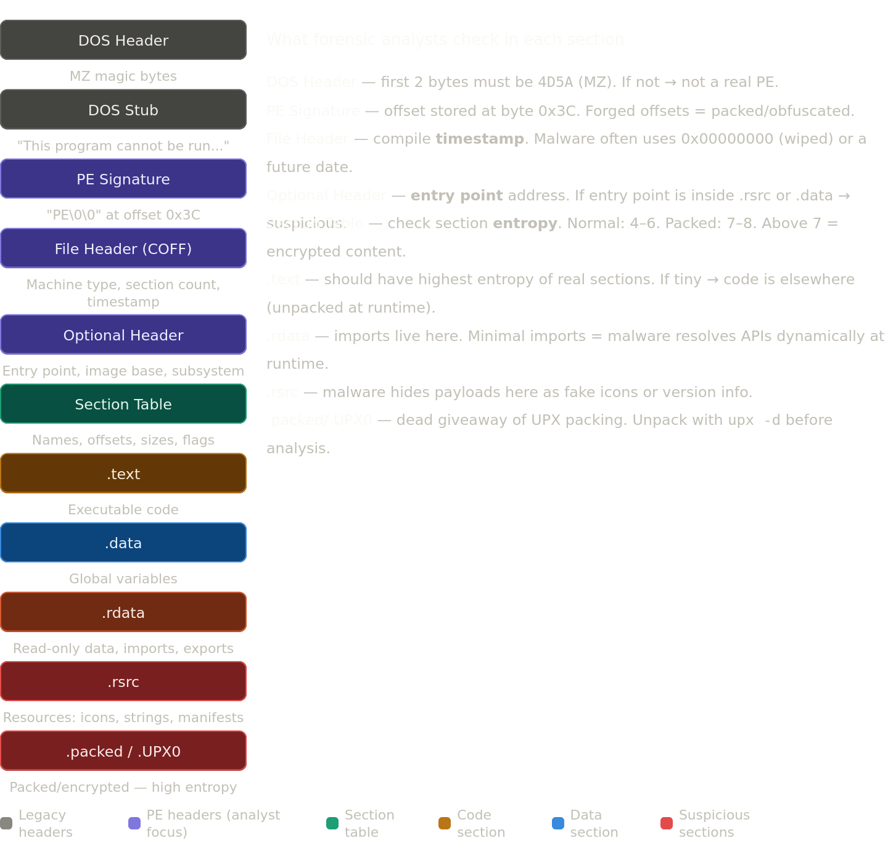
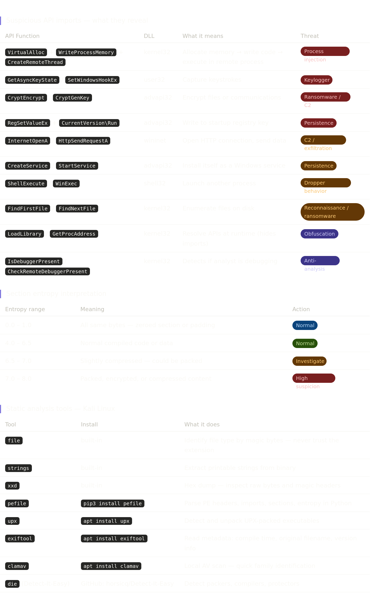
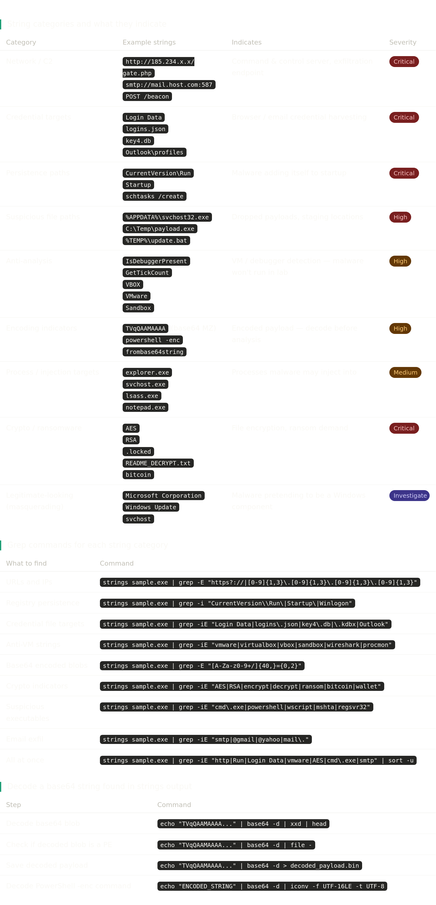
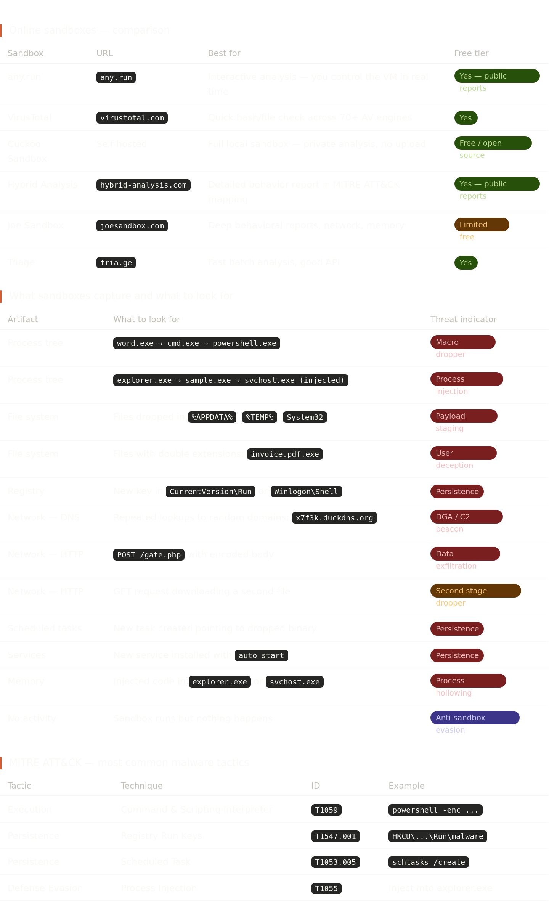
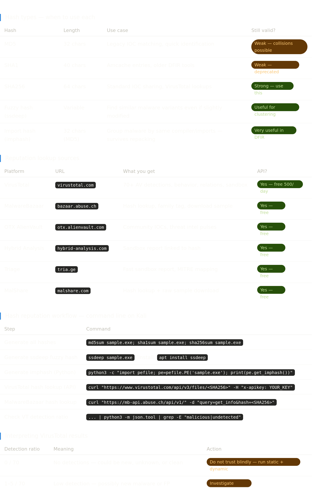

Malware forensics is a key discipline in DFIR focused on analyzing malicious files, persistence mechanisms, execution behavior, and attacker techniques. It combines static analysis (file structure, strings, PE headers, hashes) and dynamic analysis (runtime behavior, processes, registry changes, network activity). Understanding malware artifacts is essential for incident response and threat hunting.  

For hands-on practice with **PE headers**, I recommend the TryHackMe room **Dissecting PE Headers** 
> https://tryhackme.com/room/dissectingpeheaders It includes a pre-built machine, so no setup is required Tools.  It is an excellent practical lab to see the concepts from this lesson applied directly, and I strongly recommend completing it.

## PE Headers
On disk, PE a executable looks the same as any other form of digital data, i.e., a combination of bits. If we open a file in a Hex editor, we will see a random bunch of Hex characters. This bunch of Hex characters are the instructions a Windows needs to execute this binary file.

2.Static Analysis — Key Points

1. Strings Analysis : What to Hunt For

)4. Behavioral Sandboxing

1. Hash Reputation
