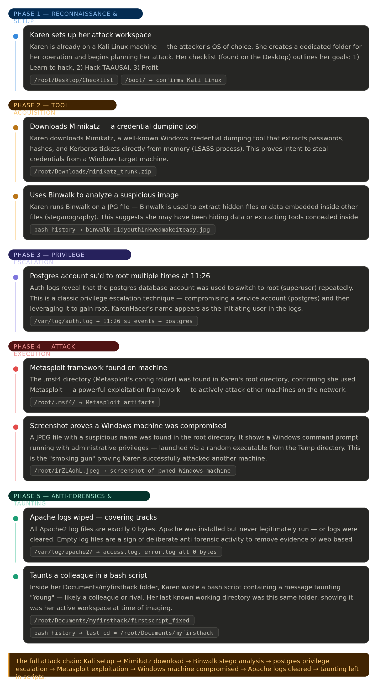

The course notes are way important, I advise you to read all and go through it as the most of techniques/terms will be used in the next Lab.

### Insider Lab - Endpoint Forensics
https://cyberdefenders.org/blueteam-ctf-challenges/insider/
**First** CyberDefenders is cybersecurity training platform where it contains many labs for different scenarios. It is designed for blue teamers to gain practical skills, allowing users to investigate real-world incidents. It has free limited access for some retired lab ( I only choose the free ones to train with ).  

This is the full official walkthrough https://cyberdefenders.org/walkthroughs/insider/  however I will note here the interesting stuffs and more explained terms.

to open the disk image => It reveals the full system architecture and the distribution( Linux version 4.13.0-kali1-amd64) 
## The MD5 hash (question 2)
Hashing is a cryptographic process used to generate a fixed-length string, called a hash value, from input data of any size. This process is deterministic, meaning the same input will always produce the same hash. 
In I** digital forensics**, hash values are critical for verifying the authenticity of evidence and identifying tampered or altered files.

| Use                         | Why                                                                               |
| --------------------------- | --------------------------------------------------------------------------------- |
| **Evidence integrity**      | Hash the original, hash your copy , if they match, the copy is forensically sound |
| **Chain of custody**        | Hash value is recorded in court documents to prove evidence wasn't modified       |
| **Verifying images**        | FTK Imager uses it to verify E01/DD images after creation                         |
| **Identifying known files** | Compare hashes against known malware or known good file databases                 |
| **Detecting duplicates**    | Same hash = identical file, useful in large investigations                        |
**MD5 vs SHA1 vs SHA256**

| Hash   | Length   | Speed   | Still used?                        |
| ------ | -------- | ------- | ---------------------------------- |
| MD5    | 32 chars | Fastest | Yes, but weak against collisions   |
| SHA1   | 40 chars | Fast    | Yes, still accepted in most courts |
| SHA256 | 64 chars | Slower  | Best practice today                |

## Credential dumping (question 3)
Click here to find more tools about this techniques [[Credential Dumping Tools]]

### The full Attack chain 
I am also into offensive security so mapping the full techniques is necessary for me to understand the full path. 
	( Yes, AI was used to generate the picture below)

