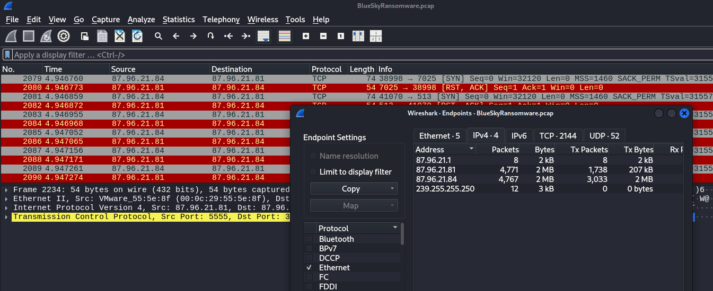

Lab : https://cyberdefenders.org/blueteam-ctf-challenges/bluesky-ransomware/ ( medium). Check the official write up.

In this Lab you will be analyzing network traffic, decoding powershell scripts, and examining persistence mechanisms to identify attacker tactics and IOCs ( Indicators of compromise ) in this ransomware Lab.
Now as tools you will mainly need Wireshark and Event Viewer 
#### the source IP responsible for potential port scanning activity

This critical  endpoint in this analysis is the IP address `87.96.21.84`, which transmitted 3033  packets ( showing in pcap file ) totaling 2 MB and received 1,734 packets totaling 207 KB. Such high transmission activity suggests scanning behavior, as it mirrors the volume of requests and responses expected during port scans.
( Hint : always look for the IP who had excessive volume of transmitted `SYN` packets targeting various ports = indicative of probing attempts)

#### the account targeted by the attacker.
`Tabular Data Stream` (TDS)  (an application-layer protocol used by clients to interact with database servers, primarily Microsoft SQL Server and Sybase, facilitating authentication, SQL requests, and result sets)

The command, `EXEC sp_configure 'xp_cmdshell', 1; RECONFIGURE;`, is particularly noteworthy. This command enables the `xp_cmdshell` stored procedure, which allows SQL Server to execute operating system commands directly from the database. Once enabled, the attacker can use this feature to run arbitrary system commands, effectively turning the database server into a launch point for further attacks.

### Full Attack stages 
**Stage 1 - Reconnaissance:** The attacker at `87.96.21.84` performed a TCP SYN scan against the target, sending many many packets to map open ports and identify services.

**Stage 2 - Initial Access:** An MSSQL brute-force attack over the TDS protocol succeeded, leads to gaining access with the `sa` (system administrator) account using the password `cyb3rd3f3nd3r$`.

**Stage 3 - Execution foothold:** The attacker enabled `xp_cmdshell` via SQL Server's `sp_configure`( turning the database server into a command execution engine) SMART!   but Windows Event ID 15457 confirmed this change.

**Stage 4 -  Privilege escalation:** A Metasploit C2 payload was injected into `winlogon.exe` (a high-privilege Windows process), granting administrative control. PowerShell Event ID 400 logged the engine startup with hostname `MSFConsole`.

**Stage 5 -  Payload delivery (checking.ps1):** a powerShell script was downloaded and used to verify admin group membership by checking SID `S-1-5-32-544`.

**Stage 6 - Defense evasion (del.ps1):** A second script disabled Windows Defender by modifying 5 registry keys under `HKLM:\SOFTWARE\Microsoft\Windows Defender` and stopping the `WinDefend` service. MITRE: `TA0005 / T1562.001`.

**Stage 7 - Persistence:** A scheduled task named `\Microsoft\Windows\MUI\LPUpdate` was created to re-run `del.ps1` every 4 hours as `SYSTEM`, blending in with legitimate Windows tasks.

**Stage 8 - Credential access:** `Invoke-PowerDump.ps1` wasalso  downloaded and executed to dump NTLM hashes from LSASS/SAM, saving them to `C:\ProgramData\hashes.txt`.

**Stage 9 - Lateral movement:** Using `Invoke-SMBExec` with the dumped hashes and a host list from `extracted_hosts.txt`, the attacker moved laterally freely across the network via SMB (ports 139/445).

**Stage 10 & 11 - Impact:** The famous BlueSky ransomware (SHA-256: `3e035f2d...`) was deployed across the network via SMB. It encrypted fall the files :(

